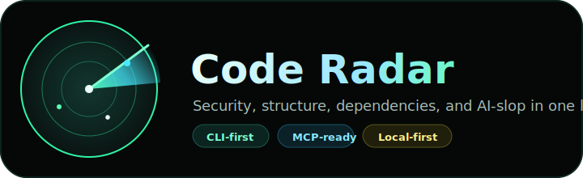

<p align="center">
  
</p>

<p align="center">
  <a href="https://github.com/T-and-T-soft/code-radar/releases/latest"></a>
  <a href="LICENSE"></a>
  <a href="action/action.yml"></a>
  <a href="https://www.rust-lang.org/"></a>
  <a href="docs/mcp.md"></a>
  <a href="docs/schemas/inspector-report-1.0.json"></a>
</p>

<p align="center">
  <a href="#install">Install</a>
  · <a href="#free-preview">Free Preview</a>
  · <a href="#terminal-experience">CLI</a>
  · <a href="#cli-animation">Animation</a>
  · <a href="#mcp">MCP</a>
  · <a href="#github-actions">GitHub Actions</a>
  · <a href="#configuration">Config</a>
  · <a href="docs/security/mcp-threat-model.md">Threat model</a>
  · <a href="SECURITY.md">Security</a>
</p>

<h1 align="center">Code Radar</h1>

<p align="center">
  <strong>Run one command. See security, structure, dependencies, and AI-slop before the PR does.</strong>
</p>

<p align="center">
  Local-first code review radar for engineers, CI, and coding agents.
</p>

```bash
radar
```

```txt
Code Radar Cockpit | workspace: .

Profile      Checks                 Actions
Local        [x] Full security      Run selected scan
Fast         [x] Baseline           Run quick scan
Strict       [ ] Diff against main  Check license
CI preview   [ ] Disable cache      Show MCP setup
```

Code Radar is a native quality gate for modern codebases. It scans security,
structure, dependency risk, and slop signals, including AI-slop and copy-paste
artifacts, in one fast local pass. Then it turns the result into a concise
merge-readiness report for humans, CI, and coding agents.

It is not just a safety scanner. Radar answers the question reviewers actually
care about: can this code be merged, or will it create security, structure, or
maintenance debt?

## Built In Rust

Radar is a native Rust CLI. The scanner, report engine, MCP server, cache, SCA
pack reader, taint engine, updater, and GitHub Action runtime all use the same
compiled binary. That keeps local scans, CI runs, and agent workflows fast and
consistent across macOS, Linux, Windows, and GitHub-hosted runners.

## Quick Links

| Surface | Start here |
| --- | --- |
| Free Preview | `radar activate --free --email you@example.com`, `radar scan . --quick` |
| Local CLI | `radar`, `radar scan .`, `radar explain src/file.ts:42` |
| Agent repair | `radar prompt . --diff --copy` |
| MCP | [docs/mcp.md](docs/mcp.md), `radar mcp install all` |
| CI | `radar scan . --sarif radar.sarif --github-annotations --fail-on high` |
| Licensing | [docs/licensing.md](docs/licensing.md), `radar activate <license-key>` |
| Config | [docs/configuration.md](docs/configuration.md), `.radar.toml` |
| Report schema | [docs/schemas/inspector-report-1.0.json](docs/schemas/inspector-report-1.0.json) |
| Air-gapped | [docs/air-gapped-install.md](docs/air-gapped-install.md) |
| Security | [SECURITY.md](SECURITY.md) |

## Why Radar

- One command: run `radar` in any repo and get an interactive local cockpit.
- Native-first: fast built-in rules, no external scanner required by default.
- Multi-domain: security, secrets, dependencies, architecture, SOLID, slop, and
  source-shape checks.
- Agent-ready: MCP tools and copy-paste repair briefs for Codex, Claude, Cursor,
  and other MCP clients.
- CI-ready: JSON, SARIF, HTML, GitHub annotations, baselines, policies, and
  deterministic exit gates.
- Local by default: SCA uses the bundled or cached `vuln.radarvdb` pack, with
  background chunk updates and no scan-time OSV calls.

## Terminal Experience

Run this:

```bash
radar
```

In an interactive terminal, you get a keyboard-driven cockpit with real screens:
Dashboard, Settings, Integrations, License, and Results. Settings can write a
starter `.radar.toml`; Integrations can install MCP clients and write the
GitHub Actions workflow; License can refresh status or activate from
`RADAR_LICENSE_KEY`.

Controls: `Tab` / arrow left-right changes screens, arrow up-down selects an
item, `Enter` applies it, and `q` exits.

Automation stays explicit and script-friendly:

```bash
radar scan .
```

That command prints the compact merge-readiness view:

```txt
Code Radar - instant merge-readiness
Status: Security blocked - fix high-risk security before merge
Project: TypeScript - TypeScript | Files scanned: 2

Signals
  Security health  Risk     [----------] 0%
  Slop             Clean    [----------] 0
  Structure health Ready    [##########] 100%
  Cap       security <= 0% - High-risk security findings cap security health until the blocker is remediated
  Findings         Blockers 2 active | 1 critical, 1 high

Action plan
  1 focused lane from 2 active findings. Start with Review security findings.
  1. Review security findings - Resolve remaining security findings by severity before code-health cleanup.
```

The report is designed for repeated use: scan, fix the first lane, scan again.
For deeper inspection, switch output without changing the scan:

```bash
radar scan . --format html > radar.html
radar scan . --format json > radar.json
radar scan . --format sarif --fail-on high
```

## CLI Animation

The animated radar view is still in the CLI.

When stderr is attached to a real terminal, `radar scan` starts a 30 FPS TTY radar
sweep with live domain captions and scan stats. It is intentionally disabled
when output is not interactive so reports stay clean for pipes, files, and CI.

Animation is shown when:

- `radar scan` runs in an interactive terminal;
- progress is enabled in config;
- `CI` is not set;
- `--quiet` and `--no-progress` are not used.

Animation is suppressed when:

- output is running in CI;
- stderr is redirected;
- `--quiet` or `--no-progress` is passed;
- `[scan.report].show_progress = false` is set.

Use this when recording a demo:

```bash
radar scan fixtures/repos/viral_demo
```

Use this when you need clean machine output:

```bash
radar scan . --quiet --format json
```

## Install

```bash
curl -fsSL https://github.com/T-and-T-soft/code-radar/releases/latest/download/radar-cli-installer.sh | sh
radar --version
radar activate --free --email you@example.com
radar
```

Free Preview is local CLI only: one machine, quick scans, 100 files, terminal
output, no MCP, no GitHub Actions, and no report exports. Upgrade for full local
scans, MCP, SARIF/JSON/HTML exports, and CI gates.

Pin a release:

```bash
curl -fsSL https://raw.githubusercontent.com/T-and-T-soft/code-radar/main/scripts/install.sh | RADAR_INSTALL_VERSION=v0.1.0 sh
```

Build from source in a private source checkout:

```bash
cargo build --release -p radar-cli
./target/release/radar
```

Update an installed release:

```bash
radar update status
radar update check
radar update install
radar update rollback
```

## Core Commands

```bash
radar                              # interactive local cockpit
radar scan .                       # explicit scan
radar verify . --since main        # merge gate for changed code
radar prompt . --diff --copy       # repair brief for an agent/editor
radar explain SEC-SQLI-001         # explain a rule
radar explain src/users.ts:42      # explain a finding by location
radar rules --category security    # inspect the rule catalog
radar doctor                       # environment and config diagnostics
radar activate --free --email you@example.com
radar activate <license-key>        # claim machine/repository license slots
radar license status                # inspect local/server license status
radar update check                  # check for a newer release
radar init                         # config, ignore file, and GitHub workflow
```

## Free Preview

Code Radar can be tried without a paid license:

```bash
radar activate --free --email you@example.com
radar scan . --quick
```

The free preview is intentionally narrow so it does not replace paid plans:

- 1 machine;
- local CLI only;
- quick scans only;
- 100 files per scan;
- terminal output only;
- no MCP tools;
- no GitHub Actions quality gate;
- no SARIF, JSON, HTML, or markdown report exports.

Use a paid license for full local scans, GitHub Actions, MCP workflows,
exportable reports, and larger repositories.

## What Radar Checks

Security:

- SQL injection, command injection, path traversal, XSS, SSRF, weak crypto,
  weak randomness, JWT trust bugs, unsafe CORS/CSP, stack traces, leaked secrets.

Structure:

- architecture boundary breaches, SOLID drift, oversized implementation files,
  wrapper services, fake abstraction, duplicated implementation blocks.

Slop:

- placeholder logic, swallowed errors, TODO/stub churn, hardcoded local URLs,
  generated-code noise, low-signal copy-paste patterns.

Dependencies:

- lockfile-aware native SCA, bundled malicious-package database, optional OSV
  CVE/GHSA checks.

## Security Rule Feeds

Radar security checks have three layers:

1. Native rules compiled into Radar: AST, taint, secrets, command/path/SQL/XSS,
   auth, crypto, CORS/CSP, and structure-aware security checks.
2. Bundled regex pack embedded into the release binary at build time.
3. Public feed cache that can refresh from open upstreams:
   Gitleaks, GitLab SAST rules, and opengrep rules.

The default is local-first and auto-refreshing:

```toml
[rules]
update = "auto"
update_interval_hours = 168
update_feeds = "public"
```

Operational commands:

```bash
radar rules status                 # cache path, feed versions, rule count
radar rules --pack --category pack # inspect effective cached/bundled pack
```

If network is unavailable, Radar falls back to the bundled pack. For fully
offline environments:

```toml
[rules]
update = "bundled"
```

Dependency intelligence is separate:

```bash
radar vuln-db status
```

- Malware package checks use the bundled/cached local database.
- Dependency advisory checks use the compact local OSV mirror.
- Heavy feed ingestion runs daily in GitHub Actions; local CLI/MCP refresh only
  changed `vuln.radarvdb` chunks in the background.
- Scans never call OSV or upstream vulnerability feeds directly.

## Outputs

Radar keeps stdout useful for humans by default, but can emit every artifact CI
needs:

```bash
radar scan . \
  --json-out radar.json \
  --sarif radar.sarif \
  --html-out radar.html \
  --github-annotations \
  --fail-on high
```

Supported formats:

- terminal summary
- Markdown
- JSON
- SARIF
- HTML
- GitHub Actions annotations

## Licensing

Production release builds enforce server-validated signed Code Radar
entitlements across CLI, MCP, and GitHub Actions. Activate once per machine:

```bash
radar activate RADAR-XXXXXX-XXXXXX-XXXXXX-XXXXXX
radar license status
```

For CI, use the GitHub Actions workflow below. See
[Licensing](docs/licensing.md) for Paddle, Supabase, slot-limit, and recovery
setup.

## MCP

Install Radar into supported MCP clients:

```bash
radar mcp install all
radar mcp install codex
radar mcp install claude
radar mcp install cursor
radar mcp doctor
```

Manual MCP config:

```json
{
  "mcpServers": {
    "code-radar": {
      "command": "/usr/local/bin/radar",
      "args": ["mcp"]
    }
  }
}
```

Recommended agent loop:

1. Make a change.
2. Run `scan_project_summary` or `security_diff_scan`.
3. Use `explain_finding` for the first blocker.
4. Use `agent_fix_prompt` for a focused repair handoff.
5. Run `run_quality_gate` before merge.

MCP tools:

- `scan_project_summary`
- `scan_security_full`
- `security_diff_scan`
- `get_file_insights`
- `get_recommendations`
- `explain_finding`
- `agent_fix_prompt`
- `apply_suppression`
- `run_quality_gate`
- `radar_doctor`
- `list_scan_ids`

MCP resources:

- `radar://config/effective`
- `radar://report/{scan_id}`

## Configuration

Initialize defaults:

```bash
radar init
```

Useful files:

- `.radar.toml` - scan config
- `.radarignore` - extra ignore rules
- `.radar/baseline.json` - accepted findings
- `radar-policy.yaml` - optional organization policy

Common knobs:

```toml
[scan.report]
show_progress = true
color = "auto"

[scan.ci]
fail_on = "high"
```

## GitHub Actions

Code Radar ships as a first-class GitHub Action. It installs the signed native
binary, validates the license online on every run, scans the repository,
uploads SARIF, writes GitHub annotations, and can block risky pull requests.

Store the license key in GitHub Secrets as `RADAR_LICENSE_KEY`.

```yaml
name: Code Radar

on:
  pull_request:
  push:
    branches: [main]

permissions:
  contents: read
  pull-requests: write
  security-events: write

jobs:
  radar:
    runs-on: ubuntu-latest
    steps:
      - uses: actions/checkout@v4
      - uses: T-and-T-soft/code-radar/action@v1
        id: radar
        with:
          license-key: ${{ secrets.RADAR_LICENSE_KEY }}
          fail-on: high
          upload-sarif: "true"
          comment-pr: "true"

      - run: echo "Radar status is ${{ steps.radar.outputs.status }}"
```

For a local workflow file, run:

```bash
radar init
```

## Development

These commands are for the private source checkout. The public distribution
repository contains the GitHub Action, installer, docs, and release assets.

```bash
cargo fmt --all -- --check
cargo check --workspace
cargo test --workspace
cargo clippy --workspace --all-targets -- -D warnings
```

## Docs

- [Configuration](docs/configuration.md)
- [MCP](docs/mcp.md)
- [Native SCA](docs/sca-native.md)
- [Air-gapped install](docs/air-gapped-install.md)
- [Report schema](docs/schemas/inspector-report-1.0.json)
- [Security](SECURITY.md)

## License

MIT
