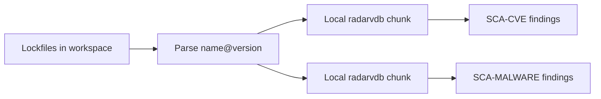

# Native SCA (built-in vulnerability scanner)

Code Radar ships **builtin SCA** (`radar-vuln`):

- **CVE / GHSA / ecosystem advisories** — local chunked OSV mirror only.
- **Malware** — local chunked OSSF malicious package mirror (`SCA-MALWARE-*`), bundled + daily cache update.

No external dependency-audit binaries required.

## How it works



1. Discover lockfiles (`package-lock.json`, `Cargo.lock`, `bun.lock`, …).
2. Deduplicate `(ecosystem, name, version)` across monorepo roots.
3. **Local advisories:** compute the package chunk id and query bundled / cached `vuln.radarvdb` records.
4. **Malware:** query the same local package chunk for OSSF malicious matches.
5. **Refresh:** background prefetch checks the daily manifest and downloads only changed chunks.

## Configuration

```toml
[security]
enable_sca = true

[sca]
cache_update_interval_hours = 24
cache_url = "https://github.com/T-and-T-soft/code-radar/releases/download/vuln-db-latest"

[sca.feeds]
malicious = true
osv = true                # compact OSV mirror: npm, PyPI, crates.io, Go, Pub
```

Environment:

| Variable | Effect |
|----------|--------|
| `RADAR_VULN_PACK_CACHE_DIR` | Override local `vuln.radarvdb` cache directory |
| `RADAR_VULN_PACK_PATH` | Developer-only local `vuln.radarvdb` source for refresh tests |
| `RADAR_VULN_PACK_MANIFEST_URL` | Override remote `vuln.radarvdb.manifest.json` URL |
| `RADAR_VULN_PACK_BASE_URL` | Override remote chunk asset base URL |
| `RADAR_MALICIOUS_DIR_PATH` | Builder-only OSSF checkout path for the daily cache workflow |
| `RADAR_OSV_DUMP_DIR` | Builder-only directory with `<ecosystem>/all.zip` dumps |
| `RADAR_OSV_ECOSYSTEMS` | Builder-only comma list, default `npm,PyPI,crates.io,Go,Pub` |

`RADAR_OFFLINE=1` is only for air-gapped or deterministic test runs. Normal
scans do not need it: SCA already uses local `vuln.radarvdb`, while background
refresh checks for newer chunks without blocking the scan.

## CLI

```bash
radar vuln-db status   # local pack path, chunks, counts, checksum, source
```

Refresh is automatic. Heavy feed ingestion runs in GitHub Actions once per day,
publishes a chunked `vuln.radarvdb` pack, and the app atomically swaps changed
chunks in the background when a newer cache is available.

## Lockfiles

| File | Support |
|------|---------|
| `Cargo.lock` | OSV `crates.io` |
| `package-lock.json`, `pnpm-lock.yaml`, `yarn.lock` | OSV `npm` |
| `bun.lock` / `bun.lockb` | OSV `npm` |
| `poetry.lock`, `uv.lock`, `requirements.txt` | OSV `PyPI` |
| `go.sum` | OSV `Go` |
| `pubspec.lock` | OSV `Pub` |

## Monorepo

All lockfiles under the scanned workspace root are parsed; packages are **deduplicated** before local cache lookups, so one lookup per unique `name@version` regardless of how many apps reference it.

## Size / network

Typical project (500 npm packages): a few hundred KB of JSON, not hundreds of MB of zip.

See [ADR-005](architecture/ADR-005-builtin-vulnerability-database.md).
